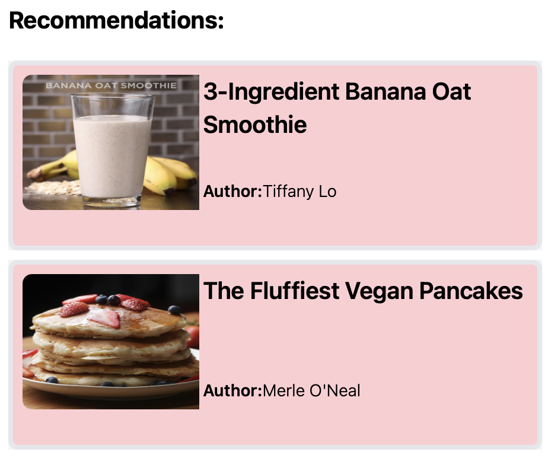
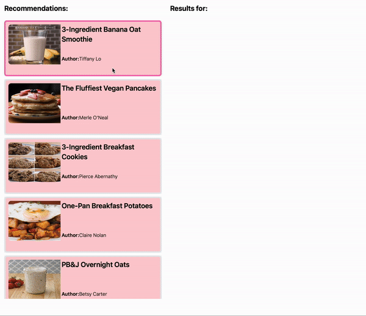
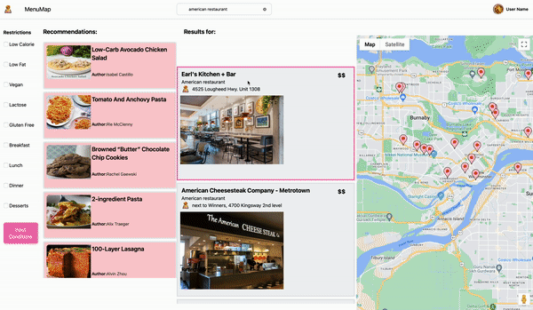

# MenuMap
**MenuMap** is a web application project that uses restaurant/dish🍔 curation and maps🗺️ to empower people who may have felt restricted in their diets to expand and experience foreign cuisines and support businesses near them📈. 

MenuMap caters to a diverse user base, from students👩🏻‍🎓 on a budget to adventurous eaters looking for a great recommendation. The app will take inputs🔤 from the user such as desired price range, type of cuisine and dietary restrictions to filter nearby restaurants and display the choices on an interactive map📍.

## Contents
1. [Tech Stack](#tech-stack)
2. [Application Features](#application-features)
3. [Licence](#licence)
3. [Acknowledgements](#acknowledgements)

## Tech Stack

[![HTML][HTML5]][HTML-url]  
HTML is the backbone of the web, providing a standardized markup language understood by all browsers. Its structured approach enhances accessibility, SEO, and content readability. We have used it to construct the body of our application.

[![CSS][CSS]][CSS-url]  
Tailwind CSS utilizes a utility-first methodology, allowing for rapid development by applying small, single-purpose classes directly in the HTML. This approach speeds up the styling process and encourages consistency.

[![React][React.js]][React-url]  
React.js follows a component-based architecture, allowing developers to build UIs by breaking them down into reusable components. This modularity enhances code reusability, maintainability, and scalability. Collectively, we are most familiar with React. It is also an industry staple thus, has a lot of support in the open-source market as well.

[![Jest][Jest]][Jest-url]  
Jest is known for its simplicity and ease of adoption. It comes with an intuitive API that allows developers to write tests quickly and efficiently. Jest supports different types of tests, including unit, integration, and end-to-end tests. Its versatility allows for comprehensive test coverage across the application stack. It was also suggested to us by our instructor taking into account our overall tech stack and hence, we decided to use it.

[![GithubActions][GitHubActions]][GitHubActions-url]  
GitHub Actions automates various workflows, including continuous integration and deployment. It allows you to build, test, and deploy code automatically, streamlining the development pipeline. As GitHub's native CI/CD solution, GitHub Actions seamlessly integrates with repositories and pull requests.

[![Netlify][Netlify]][Netlify-url]  
Netlify simplifies the deployment process by providing an intuitive interface where developers can easily deploy static sites or applications directly from their Git repositories. Continuous deployment is automated, triggered by repository updates. Moreover, we decided to use it since it's free.

## Application Features

1. **Filtering**  
preset options to filter on the basis of dietary restrictions, allergies, health stats and display recommendations  

2. **Dish Recommendations**  
this feature is especially curated for adventurous eaters ;)

3. **Dish Explanations**  
displays a short summary of what the dish is and some health stats

4. **Nearby Restaurants**  
pins nearby restaurants on a map with a brief summary of what they offer

5. **Restaurant Info**  
provides a link to restaurant website, their contact number & many more :)

## Licence
Distributed under the MIT License. See [LICENSE](./LICENSE) for more information.

## Acknowledgements

1. AI Declaration Forms  
[Jonah Kim](./Milestone1AIDisclosure/ProjectMileston1_AI_Declaration_Jonah_Kim_301395290.pdf)  
[Aarham Haider](./Milestone1AIDisclosure/ProjectMileston1_AI_Declaration_Aarham_Haider_301462422.pdf)  
[Jeet Patel](./Milestone1AIDisclosure/ProjectMileston1_AI_Declaration_Jeet_Patel_301573108.pdf)  
[Aryaman Bahuguna](./Milestone1AIDisclosure/P1_AI_Declaration_Aryaman_Bahuguna_301563474.pdf)

2. Resources  
[Documentation](https://visgl.github.io/react-google-maps/docs/get-started)  
[Youtube](https://www.youtube.com/watch?v=PfZ4oLftItk&list=PL2rFahu9sLJ2QuJaKKYDaJp0YqjFCDCtN)  

<!-- Links  -->

<!-- Badges -->
[Contributors]: https://img.shields.io/badge/Contributors_4
<!-- HTML5 -->
[HTML5]: https://img.shields.io/badge/HTML5-E34F26?style=for-the-badge&logo=html5&logoColor=white
[HTML-url]: https://en.wikipedia.org/wiki/HTML

<!-- CSS -->
[CSS]: https://img.shields.io/badge/Tailwind_CSS-38B2AC?style=for-the-badge&logo=tailwind-css&logoColor=white
[CSS-url]: https://en.wikipedia.org/wiki/Tailwind_CSS

<!-- react -->
[React.js]: https://img.shields.io/badge/React-20232A?style=for-the-badge&logo=react&logoColor=61DAFB
[React-url]: https://en.wikipedia.org/wiki/React_(software)

<!-- Jest -->
[Jest]: https://img.shields.io/badge/Jest-323330?style=for-the-badge&logo=Jest&logoColor=white
[Jest-url]: https://jestjs.io

<!-- GitHub Actions-->
[GitHubActions]: https://img.shields.io/badge/GitHub_Actions-2088FF?style=for-the-badge&logo=github-actions&logoColor=white
[GitHubActions-url]: https://github.com/features/actions

<!-- Netlify -->
[Netlify]: https://img.shields.io/badge/Netlify-00C7B7?style=for-the-badge&logo=netlify&logoColor=white
[Netlify-url]: https://www.netlify.com

